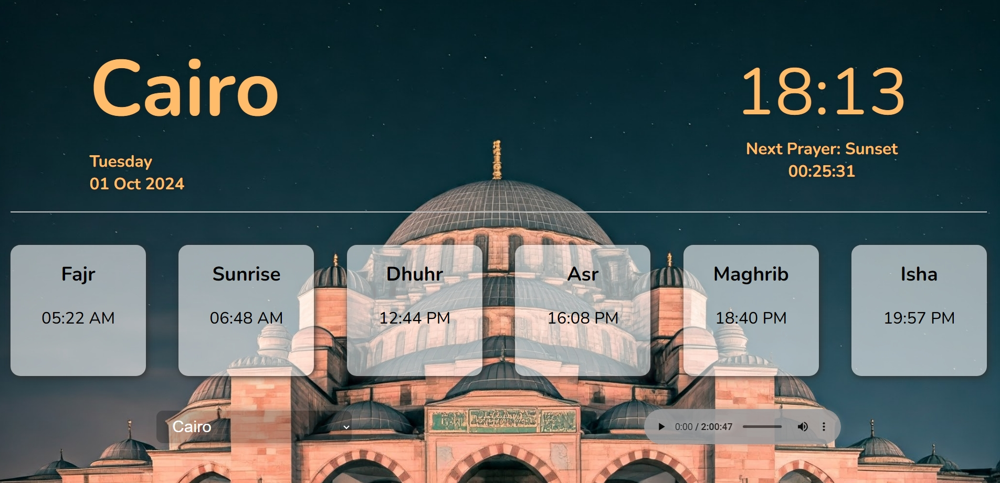

# prayerTimes-App

Prayer times App

# My Project

Here’s a screenshot of the project:


# Prayer Times Web App

This web application provides prayer times for various cities in Egypt and displays a smooth background image carousel. Users can also see a countdown to the next prayer. The data is fetched using the [Aladhan API](https://aladhan.com/prayer-times-api) and updates dynamically based on the city selected by the user.

## Features

- **Prayer Times Display**: The app fetches prayer times for Fajr, Dhuhr, Asr, Maghrib, and Isha for the selected city.
- **City Selection**: Users can choose from a predefined list of cities (Cairo, Alexandria, Suez, Asyut, Daqahliyah), and the app will update the prayer times accordingly.
- **Dynamic Countdown**: A countdown timer shows the time remaining for the next prayer. Once the prayer time is reached, it shows "It's time for prayer!".
- **Background Image Carousel**: Smoothly transitioning background images change every 15 seconds with a smooth fade in and out effect.
- **Real-Time Clock**: Displays the current time of the selected city.

## Technologies Used

- **HTML, CSS, JavaScript**: For creating the structure, styling, and functionality of the application.
- **Aladhan API**: Used to fetch real-time prayer times for different cities in Egypt.
- **Axios**: A promise-based HTTP client used to handle API requests.
- **JavaScript Date Object**: For handling and calculating times and countdowns.

## Installation & Setup

1. **Clone the repository**:

   ```bash
   git clone https://github.com/your-username/prayer-times-app.git
   cd prayer-times-app
   ```

2. **Download the required assets**:
   Make sure you have the images (`img1.jfif`, `img2.jfif`, etc.) in the `/img/` directory, as used in the background image carousel.

3. **Open `index.html`** in your browser:
   You can simply open the `index.html` file in any web browser to start the application.

## Usage

1. **Select a City**: From the dropdown menu, select one of the available cities to view its prayer times.
2. **View Prayer Times**: Once the city is selected, the application will display the prayer times, the current day, and the date.
3. **Watch the Countdown**: The countdown will begin for the next prayer, showing hours, minutes, and seconds remaining.
4. **Background Carousel**: Enjoy the smooth background image transitions as you use the app.

## API

This app uses the [Aladhan Prayer Times API](https://aladhan.com/prayer-times-api) to fetch real-time prayer timings based on city names and country.

- API URL: `http://api.aladhan.com/v1/timingsByCity`
- Example:
  ```http
  GET http://api.aladhan.com/v1/timingsByCity?country=EG&city=Cairo
  ```

## License

This project is open-source and available under the MIT License.

## Credits

- [Aladhan API](https://aladhan.com/prayer-times-api)
- [Axios](https://axios-http.com/)
